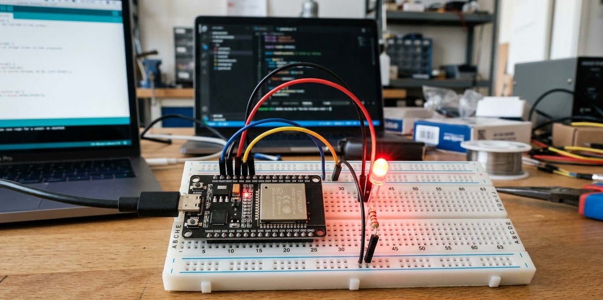

# Espressif Projects - Leds.

      

<!--------------------- PROYECTO DE LABORATORIO -------------------------->
 
<!---->

<!--------------------- ETIQUETAS DE ÁREA DEL PROYECTO -------------------------->
   
<!---orange?style=for-the-badge) -->
<!--  -->

<!-------------------- ETIQUETAS DE ESTATUS DEL PROYECTO ------------------------->

<!--  -->
<!-- -->
<!-- -->
<!--  -->

---
<!-------------------- DESCRIPCIÓN Y OBJETIVOS DEL PROYECTO ------------------------->

## Descripción y objetivos

Este carpeta contiene  firmware para microcontroladores de la familia Espressif (ESP32, ESP8266, entre otros). Aquí se almacenan todos los códigos, ejemplos de implementación y proyectos diseñados específicamente para el control, animación y manejo de LEDs de todo tipo (desde LEDs básicos y RGB, hasta tiras direccionables como WS2812B, Neopixels y matrices).

* **Objetivo Principal:** Centralizar y versionar todo el código de control de iluminación LED con placas Espressif, facilitando su reutilización para interfaces visuales en proyectos de hardware más complejos.
* **Objetivos Secundarios:**
  * Mantener una biblioteca de códigos de referencia para el manejo de diversas tecnologías de iluminación (control por PWM, protocolos de comunicación para LEDs direccionables, multiplexación).

  * Acelerar el desarrollo de nuevos sistemas embebidos y de IoT teniendo una base de código probada y funcional para indicadores de estado, retroalimentación visual y proyectos de iluminación.
---

## 📊 Gestión del Proyecto

Toda la gestión de tareas, sprints y seguimiento de issues se maneja a través de nuestro tablero de GitHub Projects.

**➡️ [Ir al Tablero del Proyecto](https://github.com/users/Additrejo/projects/2)**

---

## 📜 Tabla de Contenidos

- [Espressif Projects - Leds.](#espressif-projects---leds)
  - [Descripción y objetivos](#descripción-y-objetivos)
  - [📊 Gestión del Proyecto](#-gestión-del-proyecto)
  - [📜 Tabla de Contenidos](#-tabla-de-contenidos)
  - [👥 Equipo y Responsables](#-equipo-y-responsables)
  - [🛠️ Stack Tecnológico y Componentes](#️-stack-tecnológico-y-componentes)
    - [Software](#software)
    - [Hardware y Componentes Clave](#hardware-y-componentes-clave)
  - [📁 Estructura del Repositorio](#-estructura-del-repositorio)
  - [🚀 Instalación y Puesta en Marcha](#-instalación-y-puesta-en-marcha)
  - [💡 Uso y Operación](#-uso-y-operación)
  - [📚 Documentación Adicional](#-documentación-adicional)
  - [⚖️ Licencia](#️-licencia)

---

## 👥 Equipo y Responsables

| Nombre | Rol en el Proyecto | GitHub |
| :--- | :--- | :--- |
| AddiTrejo | Desarrollador | [@additrejo](https://github.com/additrejo) |

---

## 🛠️ Stack Tecnológico y Componentes

Lista del software, hardware y componentes clave utilizados.

### Software
* **Firmware (IDE):** [VS Code + PlatformIO](https://code.visualstudio.com/) | [Arduino IDE](https://docs.arduino.cc/software/ide/) | [ ESP-IDF](https://idf.espressif.com/)
* **Esquematicos:** [Cirkit Designer IDE](https://app.cirkitdesigner.com/)
* **Librerias:** Carpeta - Librerias.
* **Herramientas:** Carpeta - Herramientas.

### Hardware y Componentes Clave
* **Microcontrolador:** Carpeta - Microcontroladores Espressif 
* **Sensores:** Carpeta -  sensores.
* **Actuadores:** Carpeta - Actuadores.
* **Comunicaciones:** Carpeta - comunicaciones.
---

## 📁 Estructura del Repositorio

Una descripción de alto nivel de las carpetas más importantes para que cualquiera pueda encontrar lo que busca.

---

## 🚀 Instalación y Puesta en Marcha

Instalación de cada IDE:

* [VS Code + PlatformIO](https://code.visualstudio.com/) 
* [Arduino IDE](https://docs.arduino.cc/software/ide/) 
* [ESP-IDF](https://idf.espressif.com/)

---

## 💡 Uso y Operación

Cómo ejecutar el proyecto una vez instalado.

1. Selecciona el componente a probar (ej. un sensor nuevo.)

2. Navega a la carpeta correspondiente.

3. Revisa el README del componente para ver conexiones y configuraciones.

4. Conecta el hardware según el diagrama.

5. Compila y sube el código a tu IDE.

6. Observa los resultados en el monitor serie.

Si funciona bien, felicidades, no olvides etiquetarnos en tu proyecto.

---

## 📚 Documentación Adicional

Enlaces a documentación más detallada, que no encaja en el README.

* [Wiki del Proyecto](https://github.com/tu-organizacion/tu-repo/wiki) (¡Altamente recomendado usar el Wiki de GitHub!)

---

## ⚖️ Licencia

Si este repositorio te ayudó, agradeceremos los creditos.

