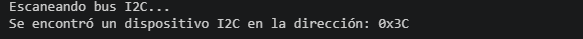

# Escáner de Dispositivos I2C para ESP32

Este proyecto contiene un sketch de Arduino diseñado para escanear el bus I2C y detectar todos los dispositivos conectados a un microcontrolador ESP32. Es una herramienta de diagnóstico esencial para verificar conexiones y encontrar direcciones de sensores o periféricos I2C.

## Descripción

El código inicializa la comunicación serie y el bus I2C en los pines GPIO 21 (SDA) y GPIO 22 (SCL) del ESP32. Luego, realiza un barrido de todas las direcciones I2C posibles (de 0x08 a 0x77) e informa a través del puerto serie cuáles responden, mostrando sus direcciones en formato hexadecimal.

## Requisitos de Hardware

- **Placa:** ESP32 (cualquier modelo).
- **Componentes adicionales:** Ninguno, a menos que tengas dispositivos I2C conectados para escanear.
- **Conexiones:**
    - **SDA (Data):** GPIO 21
    - **SCL (Clock):** GPIO 22

## Configuración del Software

1.  **Entorno de desarrollo:** Arduino IDE o PlatformIO.
2.  **Placa seleccionada:** Asegúrate de tener el soporte para ESP32 instalado en tu IDE.
3.  **Velocidad del Monitor Serie:** 115200 baudios.

## Cómo Usarlo

1.  Conecta tu ESP32 al ordenador.
2.  Conecta cualquier dispositivo I2C que desees escanear a los pines SDA (GPIO21) y SCL (GPIO22). Asegúrate de que los dispositivos tengan las resistencias de pull-up adecuadas o utiliza los pull-up internos del ESP32 si es necesario.
3.  Sube el código a tu ESP32.
4.  Abre el Monitor Serie (Herramientas -> Monitor Serie) configurado a **115200 baudios**.
5.  El programa se ejecutará una vez (en el `setup`) y mostrará los resultados del escaneo. Luego entrará en un bucle vacío (`loop`).

## Ejemplo de Salida en el Monitor Serie

En este ejemplo, se encontró una dirección `0x3C`.

## Personalización

- **Cambiar pines I2C:** Si deseas usar otros pines, modifica la línea `Wire.begin(21, 22);` en el código.
- **Rango de escaneo:** El bucle `for (byte i = 8; i < 120; i++)` escanea desde la dirección 0x08 hasta la 0x77, que son las direcciones de 7 bits estándar para dispositivos I2C.

## Notas

- El código está diseñado para ejecutarse solo una vez al inicio. Si necesitas un escaneo continuo, puedes mover el bloque de escaneo al `loop()`.
- Puedes agregar otros dispositivos y usar el botón RESET de la placa para ver las nuevas direcciones, No es necesario volver a cargar el programa.
- Las pequeñas pausas (`delay`) ayudan a la estabilidad de la comunicación.