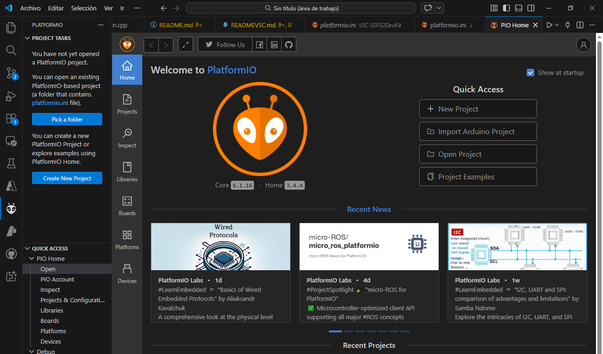
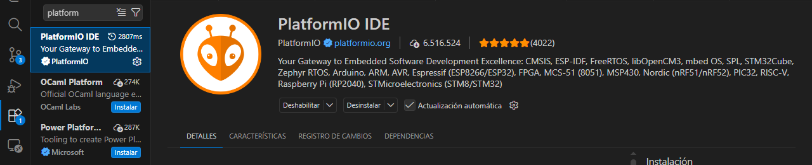
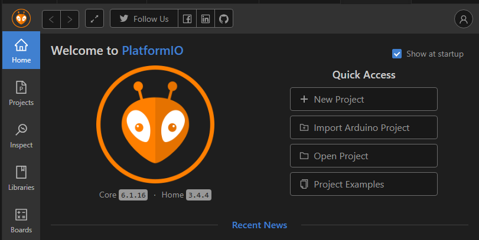
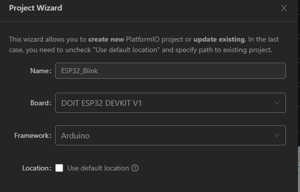

# Instalación: VS Code + PlatformIO

    

---

## Descripción y objetivos

Este documento detalla el proceso paso a paso para configurar el entorno de desarrollo profesional basado en **Visual Studio Code** y el ecosistema **PlatformIO**. Esta configuración es la recomendada para trabajar con la familia de microcontroladores **ESP32** y **ESP8266** dentro de nuestro laboratorio.

* **Objetivo Principal:** Establecer un entorno de programación robusto que permita la gestión de librerías, múltiples placas y control de versiones de forma eficiente.
* **Objetivos Secundarios:**
    * Configurar correctamente el acceso a los drivers de comunicación serie.
    * Instalar las extensiones necesarias para el desarrollo profesional con Espressif.
    * Validar la instalación mediante un proyecto de prueba.

---

## 📜 Tabla de Contenidos

- [Instalación: VS Code + PlatformIO](#instalación-vs-code--platformio)
  - 
  - [Descripción y objetivos](#descripción-y-objetivos)
  - [📜 Tabla de Contenidos](#-tabla-de-contenidos)
  - [👥 Equipo y Responsables](#-equipo-y-responsables)
  - [🛠️ Stack Tecnológico](#️-stack-tecnológico)
  - [🚀 Guía de Instalación](#-guía-de-instalación)
    - [1. Visual Studio Code](#1-visual-studio-code)
    - [2. PlatformIO IDE](#2-platformio-ide)
    - [3. Drivers USB](#3-drivers-usb)
  - [💡 Uso y Validación](#-uso-y-validación)
  - [⚖️ Licencia](#️-licencia)

---

## 👥 Equipo y Responsables

| Nombre | Rol | GitHub |
| :--- | :--- | :--- |
| AddiTrejo | Desarrollador / Documentación | [@additrejo](https://github.com/additrejo) |

---

## 🛠️ Stack Tecnológico

* **Editor de Código:** [Visual Studio Code](https://code.visualstudio.com/)
* **Ecosistema:** [PlatformIO IDE](https://platformio.org/)
* **Lenguajes:** C / C++ (Arduino Framework / ESP-IDF)
* **Hardware:** ESP32, ESP8266, STM32.

---

## 🚀 Guía de Instalación

Sigue estos pasos en orden para asegurar una configuración exitosa:

### 1. Visual Studio Code
Descarga e instala la versión estable de VS Code para tu sistema operativo desde el [sitio oficial](https://code.visualstudio.com/).
* **Nota:** Durante la instalación en Windows, asegúrate de marcar la casilla **"Agregar al PATH"**.

### 2. PlatformIO IDE
1. Abre Visual Studio Code.
2. Ve al gestor de extensiones en la barra lateral izquierda (o presiona `Ctrl+Shift+X`).
3. Busca **"PlatformIO IDE"** e instálalo.
   ](image-2.png)
4. Una vez instalado, verás un icono de una hormiga en la barra lateral. Espera a que termine de instalar el "PlatformIO Core" en la parte inferior.
5. **Reinicia VS Code** cuando el sistema lo solicite.

### 3. Drivers USB
Es indispensable instalar los drivers para que tu computadora reconozca las placas de desarrollo:
* **Driver CP210x:** [Descargar aquí](https://www.silabs.com/developers/usb-to-uart-bridge-vcp-drivers).
* **Driver CH340:** Común en modelos genéricos de ESP32/ESP8266.

---

## 💡 Uso y Validación

Para confirmar que tu instalación es correcta, sigue estos pasos:

1. Haz clic en el icono de **PlatformIO** y selecciona **PIO Home > Open**.
   
2. Selecciona **"New Project"**.
3. Elige un nombre para tu proyecto, selecciona tu placa (ej. *Espressif ESP32 Dev Module*) y el framework *Arduino*.

4. En el archivo `src/main.cpp`, pega un código de prueba (ej. Blink LED).
5. Usa los iconos de la barra inferior:
    * ✅ **Build:** Para compilar el código.
    * ➡️ **Upload:** Para subir el código a la placa.
    * 🔌 **Serial Monitor:** Para ver la salida de datos.

Si el código carga sin errores, ¡tu laboratorio está listo para programar!

---

## ⚖️ Licencia

Si esta guía te ayudó a configurar tu entorno, agradeceremos los créditos correspondientes.